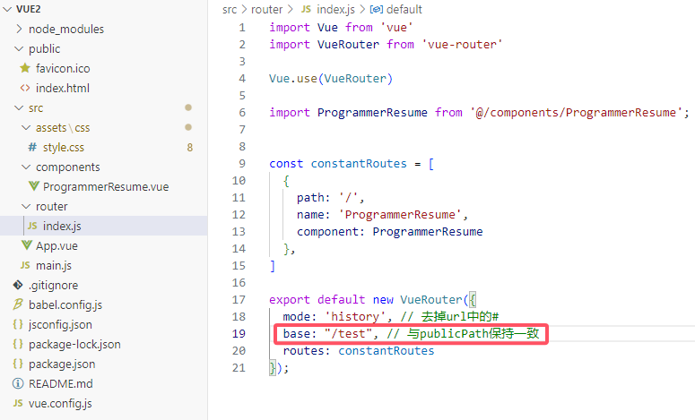
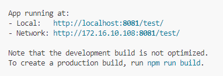
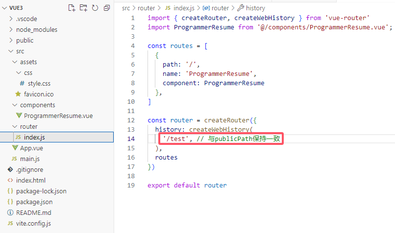
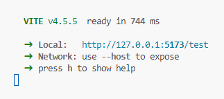

# Programmer Resume Builder - programmer-resume-builder

## Introduction

🎉🎉🎉通过仓库预设的模板来快速构建你的个人简历，并提供静态页面部署服务，可以实时共享你的简历信息给所有人。
🎉🎉🎉 Use repo templates to easily create your resume and deploy static pages for real-time sharing with others.

## Online Preview

Online preview link: [Programmer Resume | Developer Portfolio](http://47.113.186.151/preview/)

## Running Effect

### PC Running Effect

<video src="PC-HD.mp4"></video>

### Mobile Running Effect

<video src="https://gitee.com/yxx7318/programmer-resume-builder/blob/master/Phone-HD.mp4"></video>

## Usage Tutorial

### HTML Version

Just double-click to run the `index.html` file:

### Vue 2 Version

> Requires `node` version `16.18.1`, and `@vue/cli` version `5.0.8`

Modify the static resource request address:

Change the base URL of the router:

Effect after startup:

### Vue 3 Version

> Requires `vite/4.5.5 win32-x64 node-v16.18.1`

Modify the static resource request address:

Change the base URL of the router:

Effect after startup:

## Usage Instructions