# 程序员简历构建-programmer-resume-builder

## 介绍

🎉🎉🎉通过仓库预设的模板来快速构建你的个人简历，并提供静态页面部署服务，可以实时共享你的简历信息给所有人。
🎉🎉🎉 Use repo templates to easily create your resume and deploy static pages for real-time sharing with others.

## 在线预览

在线预览地址：[程序员简历 | Developer Portfolio](http://47.113.186.151/preview/)

## 运行效果

### PC端运行效果

<video src="PC-HD.mp4"></video>

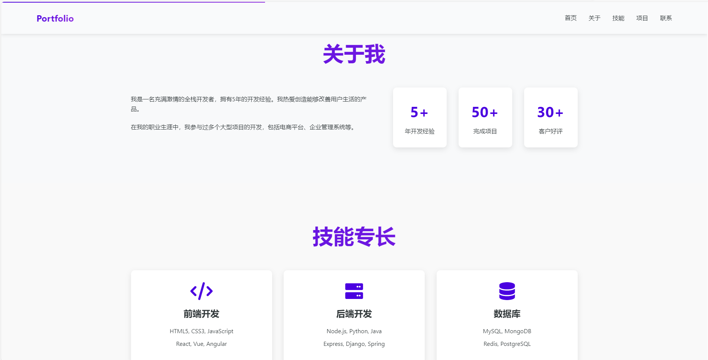

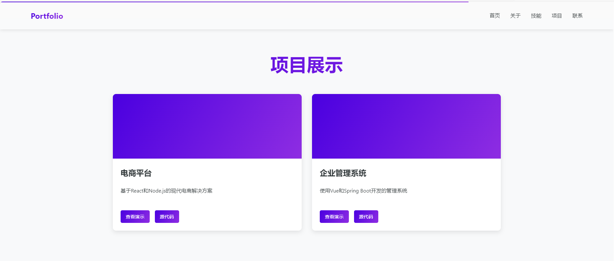

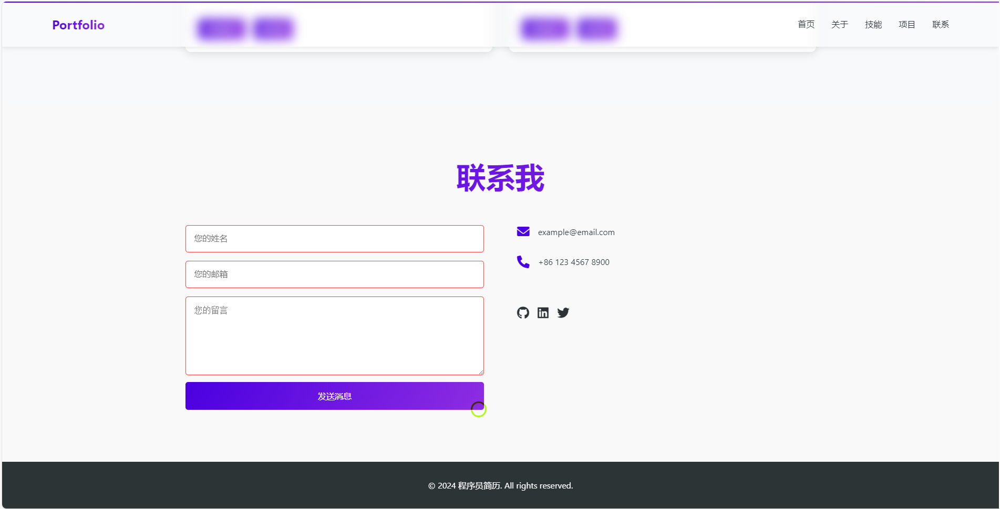

### 移动端运行效果

<video src="https://gitee.com/yxx7318/programmer-resume-builder/blob/master/Phone-HD.mp4"></video>

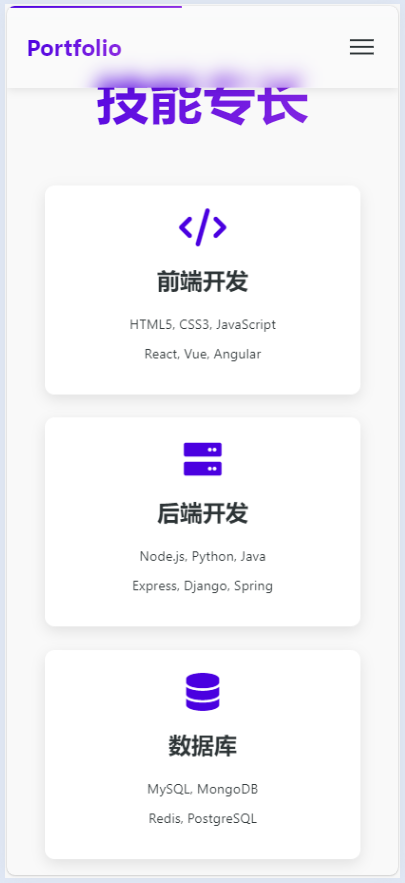

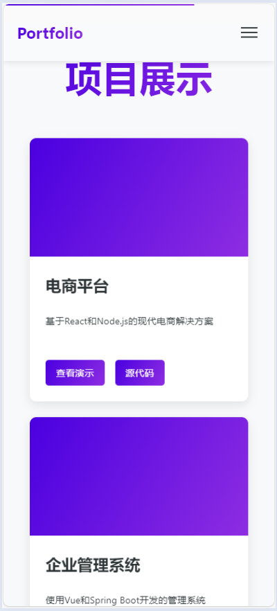

## 使用教程

### html版本

双击运行`index.html`文件即可：

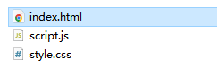

### vue2版本

> `node`版本`16.18.1`，`@vue/cli`版本`5.0.8`

修改静态资源请求地址：

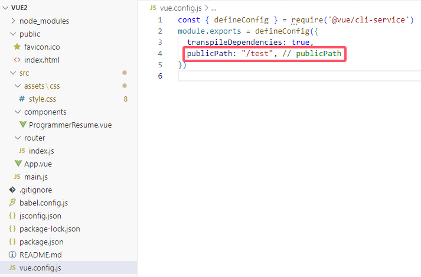

修改路由基础地址：

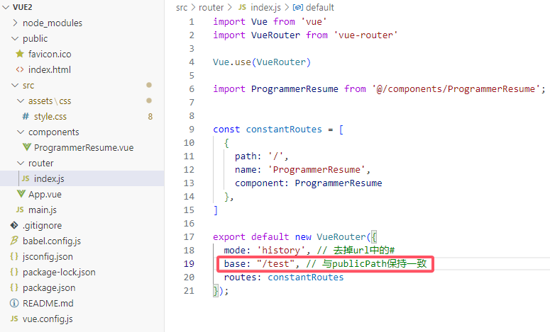

启动后效果：

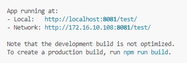

### vue3版本

> `vite/4.5.5 win32-x64 node-v16.18.1`

修改静态资源请求地址：

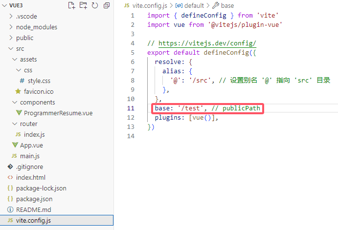

修改路由基础地址：

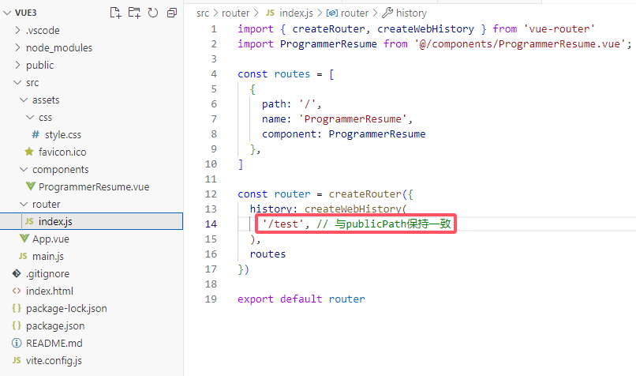

启动后效果：

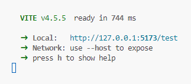

## 使用说明
